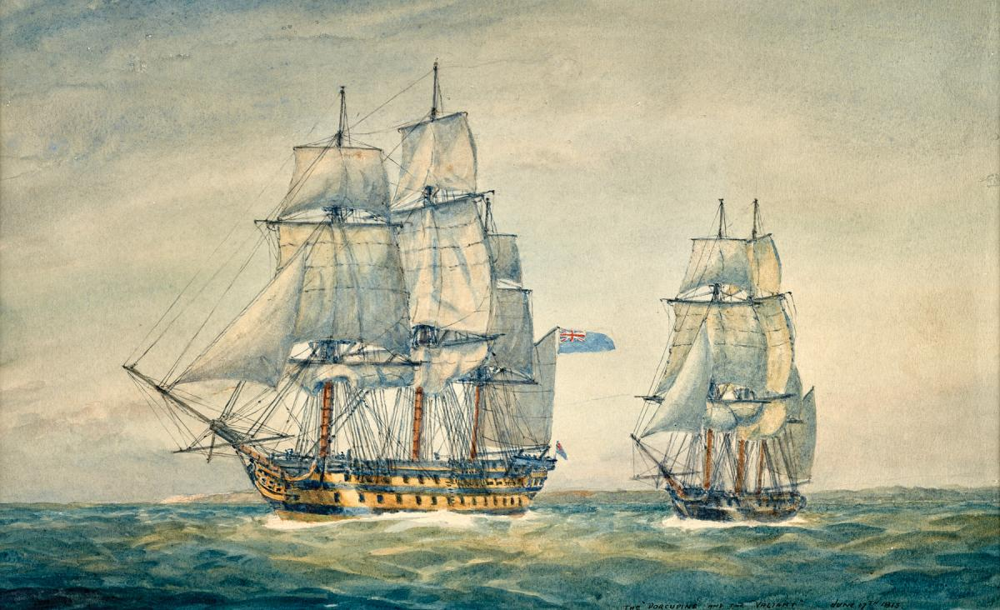

<!-- _class: lead -->
<!-- _paginate: false -->

# Title Slide

Subtitle Here

---

<!-- _class: statement -->
<!-- _paginate: false -->

# **Trafalgar**, 21 October 1805

---

# Background Image (Right)

- Point 1
- Point 2
- Point 3
- Lead-up

<!-- Presenter note. -->

---

# Background Image (Left)

- Point 1
- Point 2
- Point 3

<!-- Presenter note. -->

---

# Background Image (Narrow)

- Point 1
- Point 2
- Point 3

<!-- Presenter note. -->

---

<!-- _class: cols-2 -->

# Two Columns

- Point 1
- Point 2
- Point 3
- Point 4
- Point 5
- Point 6

---

<!-- _class: cols-2 -->

# Manual Column Break

The `col-break` utility forces the next item into a new column. Drop an empty
`

` where the split should happen (needs HTML enabled).

- Stays in column one
- Also column one

- Pushed to column two
- Also column two

---

<!-- _class: invert -->

# Dark Mode

Add `class: invert` (front-matter) or `<!-- _class: invert -->` (per slide) for a
dark variant. The accent color stays; everything else flips.

- Combinable with any layout, e.g. `_class: cols-2 invert`
- Provided by the kit's `base` layer, so it works on any custom theme

---

<!-- _class: cols-3 -->

# Three Columns

- Point 1
- Point 2
- Point 3
- Point 4
- Point 5
- Point 6
- Point 7
- Point 8
- Point 9

---

<!-- _class: compare -->

# Two Fleets

## Royal Navy

- 27 ships of the line
- Held the weather gage
- Nelson commanding

## Combined Fleet

- 33 ships of the line
- Single defensive line
- Villeneuve commanding

---

# Overlaid Text

<!-- Left: HMS Valiant, 74-guns -->
<!-- Right: US Porcupine, basically a frigate -->

---

<!-- HMS Victory in dry dock. 104-guns, first-rate. -->

---

<!-- _class: tight -->

# Dense Content

- Point 1
- Point 2
- Point 3
- Point 4
- Point 5
- Point 6
- Point 7
- Point 8
- Point 9

---

<!-- _class: closing -->
<!-- _paginate: false -->

# Questions?
