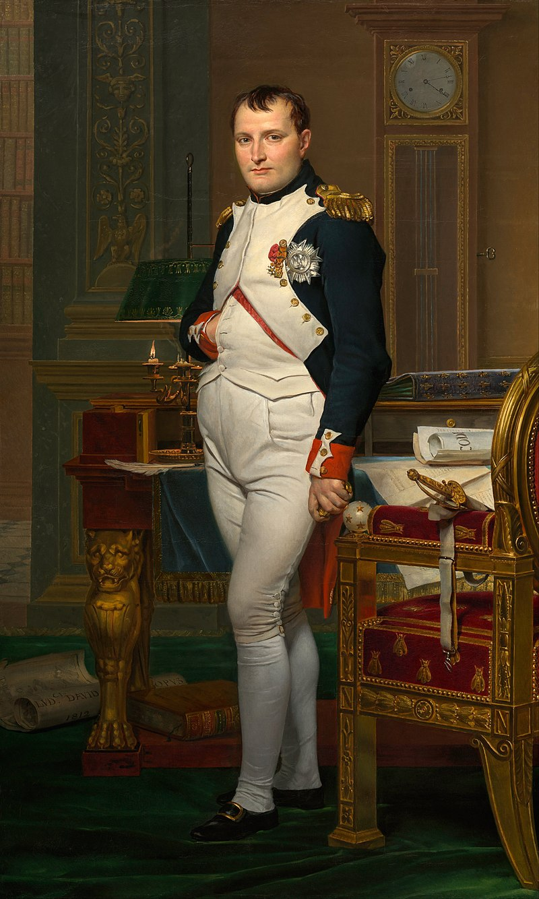

<!-- _class: lead invert -->

# Title Slide

Subtitle Here

---

# Inverted Color

<!-- _class: -->

- Point 1
- Point 2
- Point 3
- Lead-up

<!-- Presentater note. -->

---

# Left Image Slide

<!-- Font-size control -->

- Point 1
- Point 2
- Point 3

<!-- Presentater note. -->

---

# Right Image Slide

- Point 1
- Point 2
- Point 3

<!-- Presentater note. -->

---

# Two Column Layout

### Column 1

- Point 1
- Point 2
- Point 3
  <!-- Presenter note. -->

### Column 2

- Point 4
- Point 5
- Point 6
  <!-- Presenter note. -->

---

# Three Column Layout

### Column 1

- Point 1
- Point 2
- Point 3
  <!-- Presenter note. -->

### Column 2

- Point 4
- Point 5
- Point 6
  <!-- Presenter note. -->

### Column 3

- Point 7
- Point 8
- Point 9
  <!-- Presenter note. -->

---

# Overlaid Text

<!-- Left: HMS Valiant, 74-guns -->
<!-- Right: US Porcupine, basically a frigate -->

---

<!-- Image with fit -->

<!-- HMS Victory in dry dock. 104-guns, first-rate. -->

---

# Size Control

- Point 1
- Point 2
- Point 3
- Point 4
- Point 5
- Point 6
- Point 7
- Point 8
- Point 9

---

# Questions?

  <!-- That's my presentation about British Seamen! -->
